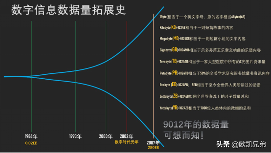
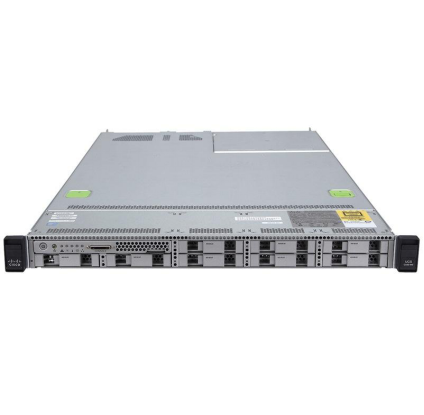
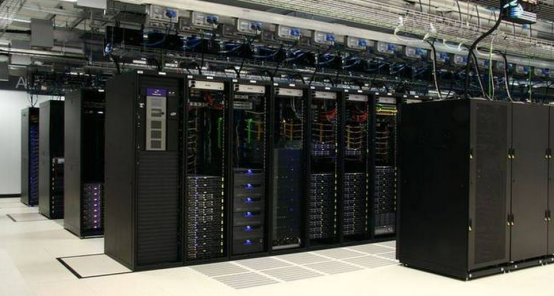
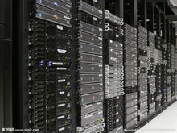
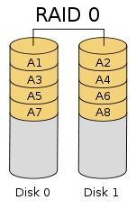
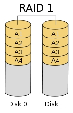
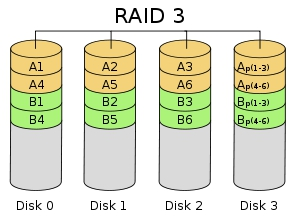
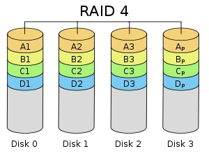
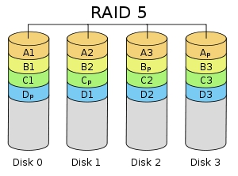

## **1.大数据导论**

### **1.1大数据概念**

大数据 (big data)， 指无法在一定时间范围内用常规软件工具进行捕捉、管理和处理的数据集合，是需要新处理模式才能具有更强的决策力、洞察发现力和流程优化能力的海量、高增长率和多样化的信息资产。

最小的基本单位是bit，按顺序给出所有单位：bit、Byte、KB、MB、GB、TB、PB、EB、ZB、YB、BB、NB、DB。

1Byte = 8bit	1K = 1024Byte	1MB = 1024K	1G = 1024M

1T = 1024G		1P = 1024T		1E = 1024P		1Z = 1024E		

1Y = 1024Z		1B = 1024Y		1N = 1024B		1D = 1024N

 

​						 

如上图所示，1986年，全球只有0.02EB也就是约21000TB的数据量，而到了2007年，全球就是280EB也就是约300000000TB的数据量，翻了14000倍。
而最近，由于移动互联网及物联网的出现，各种终端设备的接入，各种业务形式的普及，平均每40个月，全球的数据量就会翻倍！如果这样说还没有什么印象，可以再举个简单的例子，在2012年，每天会产生2.5EB的数据量。基于IDC的报告预测，从2013年到2020年，全球数据量会从4.4ZB猛增到44ZB！而到了2025年，全球会有163ZB的数据量！

由此可见，截至目前，全球的数据量已经大到爆了！而传统的关系型数据库根本处理不了如此海量的数据！

 

### **1.2大数据的特点**

1）Volume（大量）：

截至目前，人类生产的所有印刷材料的数据量是200PB，而历史上全人类总共说过的话的数据量大约是5EB。当前，典型个人计算机硬盘的容量为TB量级，而一些大企业的数据量已经接近EB量级。

2）Velocity（高速）：

这是大数据区分于传统数据挖掘的最显著特征。根据IDC的“数字宇宙”的报告，预计到2020年，全球数据使用量将达到35.2ZB。在如此海量的数据面前，处理数据的效率就是企业的生命。

3）Variety（多样）：

这种类型的多样性也让数据被分为结构化数据和非结构化数据。相对于以往便于存储的以数据库/文本为主的结构化数据，非结构化数据越来越多，包括网络日志、音频、视频、图片、地理位置信息等，这些多类型的数据对数据的处理能力提出了更高要求。

4）Value（低价值密度）：

价值密度的高低与数据总量的大小成反比。比如，在一天监控视频中，我们只关心宋老师在健身那一分钟，如何快速对有价值数据“提纯”成为目前大数据背景下待解决的难题。

 

### **1.3大数据能干啥**

1）O2O：百度大数据+平台通过先进的线上线下打通技术和客流分析能力，助力商家精细化运营，提升销量。

2）零售：探索用户价值，提供个性化服务解决方案；贯穿网络与实体零售，携手创造极致体验。经典案例，子尿布+啤酒。

3）商品广告推荐：给用户推荐访问过的商品广告类型

4） 房产：大数据全面助力房地产行业，打造精准投策与营销，选出更合适的地，建造更合适的楼，卖给更合适的人。

5）保险：海量数据挖掘及风险预测，助力保险行业精准营销，提升精细化定价能力。

6）金融：多维度体现用户特征，帮助金融机构推荐优质客户，防范欺诈风险。

7）人工智能

### **1.4企业数据部的业务流程分析**

## **2.服务器基本介绍**

服务器，也称伺服器，是提供计算服务的设备。由于服务器需要响应服务请求，并进行处理，因此一般来说服务器应具备承担服务并且保障服务的能力。

在网络环境下，根据服务器提供的服务类型不同，分为文件服务器、数据库服务器、应用程序服务器、WEB服务器等。

 服务器的构成包括处理器、硬盘、内存、系统、总线等，和通用的计算机架构类似，但是由于需要提供高可靠的服务，因此在处理能力、稳定性、可靠性、安全性、可扩展性、可管理性等方面要求较高。

可以简单的理解为服务器就是一台电脑，只不过硬盘比普通的PC机更大，CPU比普通的PC机处理速度更快，网卡比普通的PC机更快··· ···

​											

## **3.存储磁盘基本介绍**

服务器需要存储数据，免不了得要磁盘的支持，磁盘就是一类存储介质，专门用于存储我们各种类型的数据，其中磁盘按照接口类型又可以有好多种分类，接下来我们来简单看一下不同接口的各类磁盘的基本特性吧

### **3.1 SCSI接口硬盘介绍**

SCSi 传统服务器老传输接口，转速为10kr 15kr。但是由于受到线缆及其阵列卡和传输协议的限制，该盘片有固定的插法，例如要顺着末端接口开始插第一块硬盘，没有插硬盘的地方要插硬盘终结器等。该盘现已经完全停止发售。该盘只有3.5寸版。常见转速：10000转/分。

### **3.2 SAS接口硬盘介绍**

 SAS 该盘分为两种协议，即SAS1.0及SAS 2.0接口，SAS1.0接口传输带宽为3.0GB/s转速有7.2kr 10kr 15kr。该盘现已被SAS2.0接口盘取代，该盘尺寸有2.5寸及3.5寸两种。SAS2.0接口传输带宽为6.0GB/s转速有10kr 15kr，常见容量为73.6G 146G 300G 600G 900G。常见转速：15000转/分。

### **3.3 FDE/SDE接口硬盘介绍**

 FDE/SDE 该盘体前者为IBM研发的SAS硬件加密硬盘，该盘体性能等同于SAS硬盘，但是由于本身有硬件加密系统，可以保证涉密单位数据不外泄，该盘主要用于高端2.5寸存储及2.5寸硬盘接口的机器上。SED盘雷同，厂家不一样。

### **3.4 SATA硬盘基本介绍**

 SATA硬盘：用SATA接口的硬盘又叫串口硬盘，是以后PC机的主流发展方向，因为其有较强的纠错能力，错误一经发现能自动纠正，这样就大大的提高了数据传输的安全性。新的SATA 使用了差动信号系统“differential-signal-amplified-system”。这种系统能有效的将噪声从正常讯号中滤除，良好的噪声滤除能力使得SATA只要使用低电压操作即可，和 Parallel ATA 高达5V的传输电压相比，SATA 只要0.5V(500mv) 的峰对峰值电压即可操作于更高的速度之上。“比较正确的说法是：峰对峰值"差模电压”。常见转速：7200转/分。 

### **3.5 SSD硬盘介绍**

 SSD 该盘为固态硬盘，与个人PC不同的是该盘采用一类固态硬盘检测系统检测出场，并采用SAS2.0协议进行传输，该盘的性能也将近是个人零售SSD硬盘的数倍以上。

## **4.交换机基本介绍**

基本介绍：交换机（Switch）意为“开关”是一种用于电（光）信号转发的网络设备。它可以为接入交换机的任意两个网络节点提供独享的电信号通路。最常见的交换机是以太网交换机。其他常见的还有电话语音交换机、光纤交换机等。

主要作用：交换机的主要功能包括物理编址、网络拓扑结构、错误校验、帧序列以及流控。交换机还具备了一些新的功能，如对VLAN（虚拟局域网）的支持、对链路汇聚的支持，甚至有的还具有防火墙的功能

## **5.网卡的介绍**

网卡（Network Interface Card）是物理上连接计算机与网络的硬件设，是计算机与局域网通信]介质间的直接接口。由于网络技术的不同，网卡的分类也有所不同，如大家所熟知的ATM网卡、令牌环网卡和以太网网卡等。据统计，目前约有80 ％的局域网采用以太网技术。   　　

**接口方式**  　

当前台式机和笔记本电脑中常见的总线接口方式都可以从主流网卡厂商那里找到适用的产品。但值得注意的是，市场上很难找到ISA接口的100M网卡。1994年以来，PCI总线架构日益成为网卡的首选总线，目前已牢固地确立了在服务器和高端桌面机中的地位。即将到来的转变是这种网卡将推广有的桌面机中。PCI以太网网卡的高性能、易用性和增强了的可靠性使其被标 准以太网网络所广泛采用，并得到了PC业界的支持。

**技术方向**  　

目前，以太网网卡有10M、100M、10M/100M及千兆网卡。对于大数据量网络 来说，服务器应该采用千兆以太网网卡，这种网卡多用于服务器与交换机之间的连接，以提高整体系统的响应速率.

对于通常的文件共享等应用来说，10M网卡就已经足够了，但对于将来可能的语音和视频等应用来说，100M 网卡将更利于实时应用的传输。

## **6.局域网基本介绍**

局域网（Local Area Network，LAN）是指在某一区域内由多台计算机互联成的计算机组。一般是方圆几千米以内。局域网可以实现文件管理、应用软件共享、打印机共享、工作组内的日程安排、电子邮件和传真通信服务等功能。局域网是封闭型的，可以由办公室内的两台计算机组成，也可以由一个公司内的上千台计算机组成。

## **7.机架基本介绍**

为了方便管理维护众多的服务器，以及在服务器出现问题时候快读的定位解决问题，我们可以使用机架的形式，将众多的服务器归纳到一个个的机架里面去。机架之间的通信问题可以使用交换机来组织成为局域网。

​						 

 

 

## **8.IDC数据中心介绍**

互联网数据中心（Internet Data Center）简称IDC，就是电信部门利用已有的互联网通信线路、带宽资源，建立标准化的电信专业级机房环境，为企业、政府提供服务器托管、租用以及相关增值等方面的全方位服务

IDC主机托管主要应用范围是网站发布、虚拟主机和电子商务等。比如网站发布，单位通过托管主机，从电信部门分配到互联网静态IP地址后，即可发布自己的www站点，将自己的产品或服务通过互联网广泛宣传；虚拟主机是单位通过托管主机，将自己主机的海量硬盘空间出租，为其他客户提供虚拟主机服务，使自己成为ICP服务提供商；电子商务是指单位通过托管主机，建立自己的电子商务系统，通过这个商业平台来为供应商、批发商、经销商和最终用户提供完善的服务。

IDC即互联网数据中心。它是伴随着互联网不断发展的需求而迅速发展起来的，成为了新世纪中国互联网产业中不可或缺的重要一环。它为互联网内容提供商（ICP）、企业、媒体和各类网站提供大规模、高质量、安全可靠的专业化服务器托管、空间租用、网络批发带宽以及ASP、EC等业务。

IDC是对入驻（Hosting）企业、商户或网站服务器群托管的场所；是各种模式电子商务赖以安全运作的基础设施，也是支持企业及其商业联盟其分销商、供应商、客户等实施价值链管理的平台。

IDC起源于ICP对网络高速互联的需求，而且美国仍然处于世界领导者位置。在美国，运营商为了维护自身利益，将网络互联带宽设得很低，用户不得不在每个服务商处都放一台服务器。为了解决这个问题，IDC应运而生，保证客户托管的服务器从各个网络访问速度都没有瓶颈。

IDC不仅是数据存储的中心，而且是数据流通的中心，它

​																					IDC机房

应该出现在Internet网络中数据交换最集中的地方。它是伴随着人们对主机托管和虚拟主机服务提出了更高要求的状况而产生的，从某种意义上说，它是由ISP的服务器托管机房演变而来的。具体而言，随着Internet的高速发展，网站系统对带宽、管理维护日益增长的高要求对很多企业构成了严峻的挑战。于是，企业开始将与网站托管服务相关的一切事物交给专门提供网络服务的IDC去做，而将精力集中在增强核心竞争力的业务中去。可见，IDC是Internet企业分工更加细化的产物。

目前我国比较大的机房主要在北京、上海、广州、唐山等地。

## **9.磁盘阵列**

​		磁盘RAID的基本介绍：1988 年美国加州大学伯克利分校的 D. A. Patterson 教授等首次在论文 “A Case of Redundant Array of Inexpensive Disks” 中提出了 RAID 概念 [1] ，即廉价冗余磁盘阵列（ Redundant Array of Inexpensive Disks ）。由于当时大容量磁盘比较昂贵， RAID 的基本思想是将多个容量较小、相对廉价的磁盘进行有机组合，从而以较低的成本获得与昂贵大容量磁盘相当的容量、性能、可靠性。随着磁盘成本和价格的不断降低， RAID 可以使用大部分的磁盘， “廉价” 已经毫无意义。因此， RAID 咨询委员会（ RAID Advisory Board, RAB ）决定用 “ 独立 ” 替代 “ 廉价 ” ，于时 RAID 变成了独立磁盘冗余阵列（ Redundant Array of Independent Disks ）。但这仅仅是名称的变化，实质内容没有改变。

### **9.1 RAID0基本介绍**

​		RAID0 是一种简单的、无数据校验的数据条带化技术。实际上不是一种真正的 RAID ，因为它并不提供任何形式的冗余策略。 RAID0 将所在磁盘条带化后组成大容量的存储空间 ，将数据分散存储在所有磁盘中，以独立访问方式实现多块磁盘的并读访问。由于可以并发执行 I/O 操作，总线带宽得到充分利用。再加上不需要进行数据校验，RAID0 的性能在所有 RAID 等级中是最高的。理论上讲，一个由 n 块磁盘组成的 RAID0 ，它的读写性能是单个磁盘性能的 n 倍，但由于总线带宽等多种因素的限制，实际的性能提升低于理论值。

​		RAID0 具有低成本、高读写性能、 100% 的高存储空间利用率等优点，但是它不提供数据冗余保护，一旦数据损坏，将无法恢复。 因此， RAID0 一般适用于对性能要求严格但对数据安全性和可靠性不高的应用，如视频、音频存储、临时数据缓存空间等。

​																	 

 

### **9.2 RAID1基本介绍**

​		RAID1 称为镜像，它将数据完全一致地分别写到工作磁盘和镜像 磁盘，它的磁盘空间利用率为 50% 。 RAID1 在数据写入时，响应时间会有所影响，但是读数据的时候没有影响。 RAID1 提供了最佳的数据保护，一旦工作磁盘发生故障，系统自动从镜像磁盘读取数据，不会影响用户工作。

​		RAID1 与 RAID0 刚好相反，是为了增强数据安全性使两块 磁盘数据呈现完全镜像，从而达到安全性好、技术简单、管理方便。RAID1 拥有完全容错的能力，但实现成本高。RAID1 应用于对顺序读写性能要求高以及对数据保护极为重视的应用，如对邮件系统的数据保护。

​																		 

 

### **9.3 RAID2基本介绍**

​		RAID2 称为纠错海明码磁盘阵列，其设计思想是利用海明码实现数据校验冗余。海明码是一种在原始数据中加入若干校验码来进行错误检测和纠正的编码技术，其中第 2n 位（ 1, 2, 4, 8, … ）是校验码，其他位置是数据码。因此在 RAID2 中，数据按位存储，每块磁盘存储一位数据编码，磁盘数量取决于所设定的数据存储宽度，可由用户设定。图 4 所示的为数据宽度为 4 的 RAID2 ，它需要 4 块数据磁盘和 3 块校验磁盘。如果是 64 位数据宽度，则需要 64 块 数据磁盘和 7 块校验磁盘。可见， RAID2 的数据宽度越大，存储空间利用率越高，但同时需要的磁盘数量也越多。

​		海明码自身具备纠错能力，因此 RAID2 可以在数据发生错误的情况下对纠正错误，保证数据的安全性。它的数据传输性能相当高，设计复杂性要低于后面介绍的 RAID3 、 RAID4 和 RAID5 。

　　但是，海明码的数据冗余开销太大，而且 RAID2 的数据输出性能受阵列中最慢磁盘驱动器的限制。再者，海明码是按位运算， RAID2 数据重建非常耗时。由于这些显著的缺陷，再加上大部分磁盘驱动器本身都具备了纠错功能，因此 RAID2 在实际中很少应用，没有形成商业产品，目前主流存储磁盘阵列均不提供 RAID2 支持。

​						 

 

### **9.4 RAID3基本介绍**

​		RAID3 是使用专用校验盘的并行访问阵列，它采用一个专用的磁盘作为校验盘，其余磁盘作为数据盘，数据按位可字节的方式交叉存储到各个数据盘中。RAID3 至少需要三块磁盘，不同磁盘上同一带区的数据作 XOR 校验，校验值写入校验盘中。 RAID3 完好时读性能与 RAID0 完全一致，并行从多个磁盘条带读取数据，性能非常高，同时还提供了数据容错能力。向 RAID3 写入数据时，必须计算与所有同条带的校验值，并将新校验值写入校验盘中。一次写操作包含了写数据块、读取同条带的数据块、计算校验值、写入校验值等多个操作，系统开销非常大，性能较低。

​		如果 RAID3 中某一磁盘出现故障，不会影响数据读取，可以借助校验数据和其他完好数据来重建数据。假如所要读取的数据块正好位于失效磁盘，则系统需要读取所有同一条带的数据块，并根据校验值重建丢失的数据，系统性能将受到影响。当故障磁盘被更换后，系统按相同的方式重建故障盘中的数据至新磁盘。

​		RAID3 只需要一个校验盘，阵列的存储空间利用率高，再加上并行访问的特征，能够为高带宽的大量读写提供高性能，适用大容量数据的顺序访问应用，如影像处理、流媒体服务等。目前， RAID5 算法不断改进，在大数据量读取时能够模拟 RAID3 ，而且 RAID3 在出现坏盘时性能会大幅下降，因此常使用 RAID5 替代 RAID3 来运行具有持续性、高带宽、大量读写特征的应用。

​															 

### **9.5 RAID4基本介绍**

​		RAID4 与 RAID3 的原理大致相同，区别在于条带化的方式不同。 RAID4 按照 块的方式来组织数据，写操作只涉及当前数据盘和校验盘两个盘，多个 I/O 请求可以同时得到处理，提高了系统性能。 RAID4 按块存储可以保证单块的完整性，可以避免受到其他磁盘上同条带产生的不利影响。

​		RAID4 在不同磁盘上的同级数据块同样使用 XOR 校验，结果存储在校验盘中。写入数据时， RAID4 按这种方式把各磁盘上的同级数据的校验值写入校验盘，读取时进行即时校验。因此，当某块磁盘的数据块损坏， RAID4 可以通过校验值以及其他磁盘上的同级数据块进行数据重建。

​		RAID4 提供了 非常好的读性能，但单一的校验盘往往成为系统性能的瓶颈]()。对于写操作， RAID4 只能一个磁盘一个磁盘地写，并且还要写入校验数据，因此写性能比较差。而且随着成员磁盘数量的增加，校验盘的系统瓶颈将更加突出。正是如上这些限制和不足，RAID4 在实际应用中很少见，主流存储产品也很少使用 RAID4 保护。

​															 

 

### **9.6 RAID5基本介绍**

​		RAID5 应该是目前最常见的 RAID 等级，它的原理与 RAID4 相似，区别在于校验数据分布在阵列中的所有磁盘上，而没有采用专门的校验磁盘。对于数据和校验数据，它们的写操作可以同时发生在完全不同的磁盘上。因此， RAID5 不存在 RAID4 中的并发写操作时的校验盘性能瓶颈问题。另外， RAID5 还具备很好的扩展性。当阵列磁盘 数量增加时，并行操作量的能力也随之增长，可比 RAID4 支持更多的磁盘，从而拥有更高的容量以及更高的性能。

​		RAID5 的磁盘上同时存储数据和校验数据，数据块和对应的校验信息存保存在不同的磁盘上，当一个数据盘损坏时，系统可以根据同一条带的其他数据块和对应的校验数据来重建损坏的数据。与其他 RAID 等级一样，重建数据时， RAID5 的性能会受到较大的影响。

​		RAID5 兼顾存储性能、数据安全和存储成本等各方面因素，它可以理解为 RAID0 和 RAID1 的折中方案，是目前综合性能最佳的数据保护解决方案。 RAID5 基本上可以满足大部分的存储应用需求，数据中心大多采用它作为应用数据的保护方案。

​															 