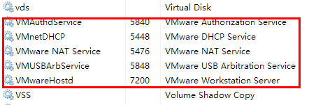
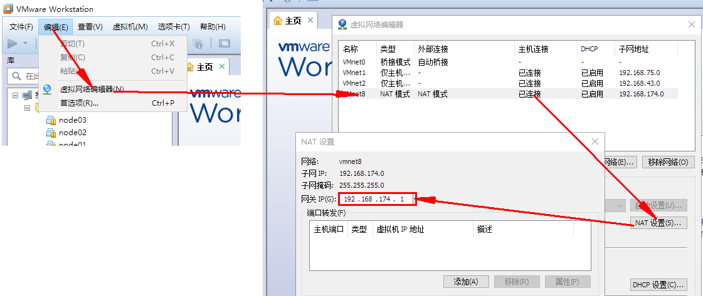
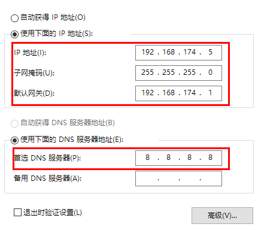

### **1. 安装前准备**

-  windows系统确认所有的关于 VMware 的服务都已经启动。



- 确认好VMware生成的网关地址



- 确认VmNet8网卡已经配置好了IP地址和DNS



- 复制虚拟机

- 集群规划

| IP              | 主机名 | 环境配置                              | 安装                                       |
| --------------- | ------ | ------------------------------------- | ------------------------------------------ |
| 192.168.174.100 | node01 | 关防火墙和SELinux, host映射, 时钟同步 | JDK, Name Node,Resource Manager, Zookeeper |
| 192.168.174.110 | node02 | 关防火墙和SELinux, host映射, 时钟同步 | JDK, Name Node,Resource Manager, Zookeeper |
| 192.168.174.120 | node02 | 关防火墙和SELinux, host映射, 时钟同步 | JDK, Name Node,Resource Manager, Zookeeper |

### **2. 虚拟机修改Mac和IP**

- 设置IP和Mac地址等

  ```shell
  vim /etc/sysconfig/network-scripts/ifcfg-ens33     #centos7默认网卡名   ifcfg-ens33
  #更改：
  BOOTPROTO="static"					#默认dhcp 
  ONBOOT="yes"						#网卡设置为  开机自自启
  
  #添加
  IPADDR=192.168.174.100				#静态IP 
  GATEWAY=192.168.174.1				#默认网关 
  NETMASK=255.255.255.0				#子网掩码  
  DNS1=114.114.114.114				#DNS 配置 114
  DNS2=8.8.8.8						#DNS 配置	谷歌
  #node01-->设置-->网络适配器-->高级-->MAC地址生成
  HWADDR="00:0C:29:35:27:EC"		#MAC地址	
  
  ```

- 修改主机名

  ```shell
  vim /etc/hostname				#改为node01
  #或者 hostnamectl set-hostname 主机名	
  ```

  ```shell
  hostname						#查看主机名
  ```

- 每台虚拟机设置IP和域名映射

  ```shell
  vim /etc/hosts
  #添加
  192.168.174.100 node01 node01.hadoop.com
  192.168.174.110 node02 node02.hadoop.com
  192.168.174.120 node03 node03.hadoop.com
  ```

- 关机重启

### **3. 虚拟机关闭防火墙和SELinux**

#### 3.1 关闭防火墙

- CentOS 7.0默认使用的是firewall作为防火墙

  ```shell
  firewall-cmd --state				#查看防火墙状态	running 开启 ； notrunning  关闭
  systemctl stop firewalld.service			#停止firewall
  systemctl disable firewalld.service			#禁止firewall开机启动
  ```

- CentOS 6.x

  ```shell
  service iptable status				#查看防火墙状态		Action:状态
  service iptables stop 				#关闭防火墙				root用户执行
  chkconfig iptables off 				#禁止开机启动
  ```

  可查看：https://www.linuxidc.com/Linux/2016-12/138979.htm

#### 3.2 关闭SELinux

- 什么是SELinux
  - SELinux是Linux的一种安全子系统
  - Linux中的权限管理是针对于文件的, 而不是针对进程的, 也就是说, 如果root启动了某
    个进程, 则这个进程可以操作任何一个文件
  - SELinux在Linux的文件权限之外, 增加了对进程的限制, 进程只能在进程允许的范围内
    操作资源

- 为什么要关闭SELinux
  - 如果开启了SELinux, 需要做非常复杂的配置, 才能正常使用系统, 在学习阶段, 在非生
    产环境, 一般不使用SELinux
  
- SELinux的工作模式
  - enforcing 强制模式
  - permissive 宽容模式
  - disable 关闭
  
  ```shell
  #修改selinux的配置文件
  vim /etc/selinux/config
  
  SELINUX=disabled			#更改SELINUX=enforcing为disabled
  ```

### **4. 虚拟机免密码登录**

- 为什么要免密登录

  - Hadoop 节点众多, 所以一般在主节点启动从节点, 这个时候就需要程序自动在主节点
    登录到从节点中, 如果不能免密就每次都要输入密码, 非常麻烦。

- 免密 SSH 登录的原理

  - 需要先在 B节点 配置 A节点 的公钥
  - A节点 请求 B节点 要求登录
  - B节点 使用 A节点 的公钥, 加密一段随机文本
  - A节点 使用私钥解密, 并发回给 B节点
  - B节点 验证文本是否正确

- **步骤**

  ```shell
  ssh-keygen -t rsa								#三台机器执行命令，生成公钥与私钥	按3次回车
  ssh-copy-id node01								#node02，node03拷贝公钥到第一台机器
  #将第一台机器的公钥拷贝到其他机器上
  scp /root/.ssh/authorized_keys node02:/root/.ssh			
  scp /root/.ssh/authorized_keys node03:/root/.ssh
  ```

  ```shell
  ssh node02  [node03]			#node01登录node02或node03
  ```


### **5. 时钟同步**

- 为什么需要时间同步

  - 因为很多分布式系统是有状态的, 比如说存储一个数据, A节点 记录的时间是 1, B节点 记录
    的时间是 2, 就会出问题。

  ```shell
  yum install -y ntp					#安装
  crontab -e							#启动
  #输入并保存
  */1 * * * * /usr/sbin/ntpdate ntp4.aliyun.com;		#与阿里云保持一致，每秒更新一次
  ```

  