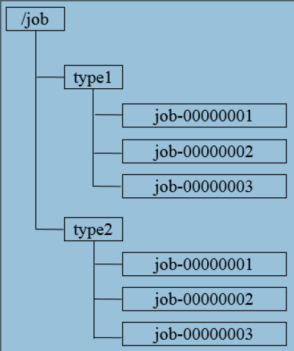
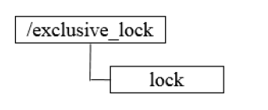
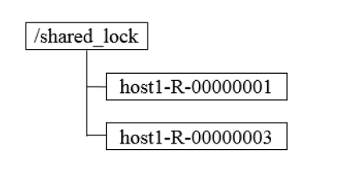
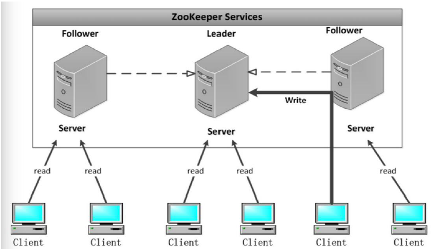
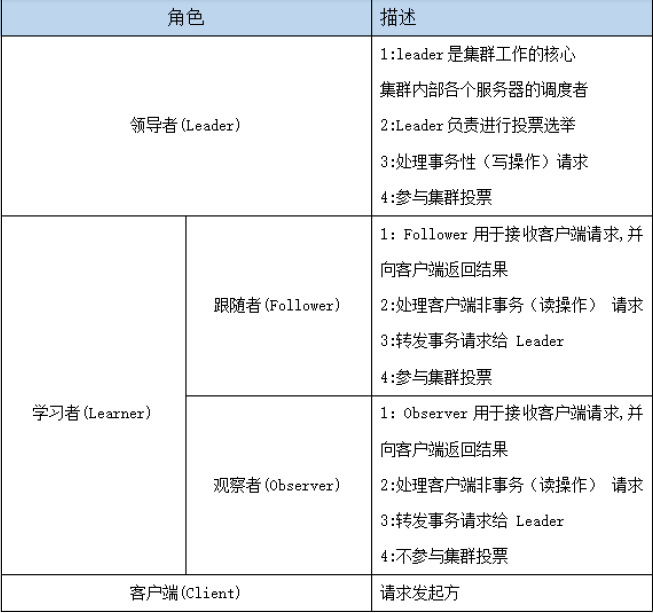
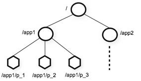

## Zookeeper

#### 1.Zookeeper 的概述

- Zookeeper 是一个开源的分布式协调服务框架 ，主要用来解决分布式集群中应用系统的一致性问题和数据管理问题

  	


#### 2.Zookeeper的特点

- Zookeeper 本质上是一个分布式文件系统, 适合存放小文件，也可以理解为一个数据库


- 在上图左侧, Zookeeper 中存储的其实是一个又一个 Znode, Znode 是 Zookeeper 中的节点
  - Znode 是有路径的, 例如 `/data/host1`, `/data/host2`, 这个路径也可以理解为是 Znode 的 Name
  - Znode 也可以携带数据, 例如说某个 Znode 的路径是 `/data/host1`, 其值是一个字符串 `"192.168.0.1"`
- 正因为 Znode 的特性, 所以 Zookeeper 可以对外提供出一个类似于文件系统的试图, 可以通过操作文件系统的方式操作 Zookeeper
  - 使用路径获取 Znode

  - 获取 Znode 携带的数据

  - 修改 Znode 携带的数据

  - 删除 Znode

  - 添加 Znode

    

#### 3.Zookeeper的应用场景

##### 3.1 数据发布/订阅

　　数据发布/订阅系统,需要发布者将数据发布到Zookeeper的节点上，供订阅者进行数据订阅，进而达到动态获取数据的目的，实现配置信息的集中式管理和数据的动态更新。

​     发布/订阅一般有两种设计模式：推模式和拉模式，服务端主动将数据更新发送给所有订阅的客户端称为推模式；客户端主动请求获取最新数据称为拉模式.

   Zookeeper采用了推拉相结合的模式，客户端向服务端注册自己需要关注的节点，一旦该节点数据发生变更，那么服务端就会向相应的客户端推送Watcher事件通知，客户端接收到此通知后，主动到服务端获取最新的数据。

##### 3.2 命名服务

　　命名服务是分步实现系统中较为常见的一类场景，分布式系统中，被命名的实体通常可以是集群中的机器、提供的服务地址或远程对象等，通过命名服务，客户端可以根据指定名字来获取资源的实体，在分布式环境中，上层应用仅仅需要一个全局唯一的名字。Zookeeper可以实现一套分布式全局唯一ID的分配机制。



　　通过调用Zookeeper节点创建的API接口就可以创建一个顺序节点，并且在API返回值中会返回这个节点的完整名字，利用此特性，可以生成全局ID，其步骤如下

　　1. 客户端根据任务类型，在指定类型的任务下通过调用接口创建一个顺序节点，如"job-"。

　　2. 创建完成后，会返回一个完整的节点名，如"job-00000001"。

　　3. 客户端拼接type类型和返回值后，就可以作为全局唯一ID了，如"type2-job-00000001"。

##### 3.3 分布式协调/通知

　　Zookeeper中特有的Watcher注册于异步通知机制，能够很好地实现分布式环境下不同机器，甚至不同系统之间的协调与通知，从而实现对数据变更的实时处理。通常的做法是不同的客户端都对Zookeeper上的同一个数据节点进行Watcher注册，监听数据节点的变化（包括节点本身和子节点），若数据节点发生变化，那么所有订阅的客户端都能够接收到相应的Watcher通知，并作出相应处理。

　　在绝大多数分布式系统中，系统机器间的通信无外乎**心跳检测**、**工作进度汇报**和**系统调度**。

　　① **心跳检测**，不同机器间需要检测到彼此是否在正常运行，可以使用Zookeeper实现机器间的心跳检测，基于其临时节点特性（临时节点的生存周期是客户端会话，客户端若当即后，其临时节点自然不再存在），可以让不同机器都在Zookeeper的一个指定节点下创建临时子节点，不同的机器之间可以根据这个临时子节点来判断对应的客户端机器是否存活。通过Zookeeper可以大大减少系统耦合。

　　② **工作进度汇报**，通常任务被分发到不同机器后，需要实时地将自己的任务执行进度汇报给分发系统，可以在Zookeeper上选择一个节点，每个任务客户端都在这个节点下面创建临时子节点，这样不仅可以判断机器是否存活，同时各个机器可以将自己的任务执行进度写到该临时节点中去，以便中心系统能够实时获取任务的执行进度。

　　③ **系统调度**，Zookeeper能够实现如下系统调度模式：分布式系统由控制台和一些客户端系统两部分构成，控制台的职责就是需要将一些指令信息发送给所有的客户端，以控制他们进行相应的业务逻辑，后台管理人员在控制台上做一些操作，实际上就是修改Zookeeper上某些节点的数据，Zookeeper可以把数据变更以时间通知的形式发送给订阅客户端。

##### 3.4分布式锁

　　分布式锁用于控制分布式系统之间同步访问共享资源的一种方式，可以保证不同系统访问一个或一组资源时的一致性，主要分为排它锁和共享锁。

　　**排它锁又称为写锁或独占锁**，若事务T1对数据对象O1加上了排它锁，那么在整个加锁期间，只允许事务T1对O1进行读取和更新操作，其他任何事务都不能再对这个数据对象进行任何类型的操作，直到T1释放了排它锁。



　① **获取锁**，在需要获取排它锁时，所有客户端通过调用接口，在/exclusive_lock节点下创建临时子节点/exclusive_lock/lock。Zookeeper可以保证只有一个客户端能够创建成功，没有成功的客户端需要注册/exclusive_lock节点监听。

　② **释放锁**，当获取锁的客户端宕机或者正常完成业务逻辑都会导致临时节点的删除，此时，所有在/exclusive_lock节点上注册监听的客户端都会收到通知，可以重新发起分布式锁获取。

**共享锁又称为读锁**，若事务T1对数据对象O1加上共享锁，那么当前事务只能对O1进行读取操作，其他事务也只能对这个数据对象加共享锁，直到该数据对象上的所有共享锁都被释放。在需要获取共享锁时，所有客户端都会到/shared_lock下面创建一个临时顺序节点



##### 3.5 分布式队列

　 有一些时候，多个团队需要共同完成一个任务，比如，A团队将Hadoop集群计算的结果交给B团队继续计算，B完成了自己任务再交给C团队继续做。这就有点像业务系统的工作流一样，一环一环地传下 去.

   分布式环境下，我们同样需要一个类似单进程队列的组件，用来实现跨进程、跨主机、跨网络的数据共享和数据传递，这就是我们的分布式队列。 


#### 4.Zookeeper的架构

Zookeeper集群是一个基于主从架构的高可用集群



​     每个服务器承担如下三种角色中的一种

- **Leader** 一个Zookeeper集群同一时间只会有一个实际工作的Leader，它会发起并维护与各Follwer及Observer间的心跳。所有的写操作必须要通过Leader完成再由Leader将写操作广播给其它服务器。

- **Follower** 一个Zookeeper集群可能同时存在多个Follower，它会响应Leader的心跳。Follower可直接处理并返回客户端的读请求，同时会将写请求转发给Leader处理，并且负责在Leader处理写请求时对请求进行投票。

- **Observer** 角色与Follower类似，但是无投票权。

	[


#### 5.Zookeeper的选举机制

 Leader选举是保证分布式数据一致性的关键所在。当Zookeeper集群中的一台服务器出现以下两种情况之一时，需要进入Leader选举。

##### 5.1. 服务器启动时期的Leader选举

　　若进行Leader选举，则至少需要两台机器，这里选取3台机器组成的服务器集群为例。在集群初始化阶段，当有一台服务器Server1启动时，其单独无法进行和完成Leader选举，当第二台服务器Server2启动时，此时两台机器可以相互通信，每台机器都试图找到Leader，于是进入Leader选举过程。选举过程如下

　　(1) 每个Server发出一个投票。由于是初始情况，Server1和Server2都会将自己作为Leader服务器来进行投票，每次投票会包含所推举的服务器的myid和ZXID，使用(myid, ZXID)来表示，此时Server1的投票为(1, 0)，Server2的投票为(2, 0)，然后各自将这个投票发给集群中其他机器。

　　(2)接受来自各个服务器的投票。集群的每个服务器收到投票后，首先判断该投票的有效性，如检查是否是本轮投票、是否来自LOOKING状态的服务器。

　　(3) 处理投票。针对每一个投票，服务器都需要将别人的投票和自己的投票进行PK，PK规则如下:

　　　　**· 优先检查ZXID**。ZXID比较大的服务器优先作为Leader。

　　　　**· 如果ZXID相同，那么就比较myid**。myid较大的服务器作为Leader服务器。

　　对于Server1而言，它的投票是(1, 0)，接收Server2的投票为(2, 0)，首先会比较两者的ZXID，均为0，再比较myid，此时Server2的myid最大，于是更新自己的投票为(2, 0)，然后重新投票，对于Server2而言，其无须更新自己的投票，只是再次向集群中所有机器发出上一次投票信息即可。

　　(4) 统计投票。每次投票后，服务器都会统计投票信息，判断是否已经有过半机器接受到相同的投票信息，对于Server1、Server2而言，都统计出集群中已经有两台机器接受了(2, 0)的投票信息，此时便认为已经选出了Leader。

　　(5) 改变服务器状态。一旦确定了Leader，每个服务器就会更新自己的状态，如果是Follower，那么就变更为FOLLOWING，如果是Leader，就变更为LEADING。

##### 5.2. 服务器运行时期的Leader选举

　　在Zookeeper运行期间，Leader与非Leader服务器各司其职，即便当有非Leader服务器宕机或新加入，此时也不会影响Leader，但是一旦Leader服务器挂了，那么整个集群将暂停对外服务，进入新一轮Leader选举，其过程和启动时期的Leader选举过程基本一致过程相同。


#### **6. Zookeeper的数据模型**

- ZooKeeper 的数据模型，在结构上和标准文件系统的非常相似，拥有一个层次的命名空间，都是采用**树形层次**结构.

  ​														

- ZooKeeper 树中的每个节点被称为—个Znode。和文件系统的目录树一样，ZooKeeper 树中的每个节点可以拥有子节点。

**但也有不同之处：**

- **Zookeeper文件系统的核心是Znode**
- **Znode 兼具文件和目录两种特点**。既像文件一样维护着数据、元信息、ACL、 时间戳等数据结构，又像目录一样可以作为路径标识的一部分，并可以具有 子 Znode。用户对 Znode 具有增、删、改、查等操作（权限允许的情况下）。

- Znode 本身并不是文件, 也不是文件夹, Znode 因为具有一个类似于 Name 的路径, 所以可以从逻辑上实现一个树状文件系统
- ZK 保证 Znode 访问的原子性, 不会出现部分 ZK 节点更新成功, 部分 ZK 节点更新失败的问题

- **Znode 存储数据大小有限制**。ZooKeeper 虽然可以关联一些数据，但并没有 被设计为常规的数据库或者大数据存储，相反的是，它用来管理调度数据， 比如分布式应用中的配置文件信息、状态信息、汇集位置等等。这些数据的 共同特性就是它们都是很小的数据，通常以 KB 为大小单位。ZooKeeper 的服 务器和客户端都被设计为严格检查并限制**每个 Znode 的数据大小至多 1M**，常规使用中应该远小于此值。
- **Znode 通过路径引用**，如同 Unix 中的文件路径。**路径必须是绝对的**，因此他 们必须由斜杠字符来开头。除此以外，他们必须是唯一的，也就是说每一个 路径只有一个表示，因此这些路径不能改变。在 ZooKeeper中，路径由 Unicode 字符串组成，并且有一些限制。字符串"/zookeeper"用以保存管理 信息，比如关键配额信息。如果想要选取一个 `Znode`, 需要使用路径的形式, 例如 `/test1/test11`
- 每个 Znode 由 3 部分组成:
  - stat：此为状态信息, 描述该 Znode 的版本, 权限等信息
  - data: 数据, 每个Znode都是可以携带数据的, 无论是否有子节点
  - children`: 子节点列表


#### **7. Znode节点类型**

- Znode 有两种，分别为临时节点和永久节点。节点的类型在创建时即被确定，并且不能改变。
  - **临时节点：**该节点的生命周期依赖于创建它们的会话。一旦会话结束，临时 节点将被自动删除，当然可以也可以手动删除。**临时节点不允许拥有子节点**。
  - **永久节点：**该节点的生命周期不依赖于会话，并且只有在客户端显示执行删除操作的时候，他们才能被删除。
- Znode 还有一个序列化的特性，如果创建的时候指定的话，该 Znode 的名字后面会自动追加一个不断增加的序列号。序列号对于此节点的父节点来说是唯一的，这样便会记录每个子节点创建的先后顺序。它的格式为“%10d”(10 位数字，没有数值的数位用 0 补充，例如“0000000001”)。

- 会存在四种类型的 Znode 节点，分别对应：
  - PERSISTENT：永久节点
  - EPHEMERAL：临时节点
  - PERSISTENT_SEQUENTIAL：永久节点、序列化
  - EPHEMERAL_SEQUENTIAL：临时节点、序列化


#### **8. Zookeeper安装**

​		**集群规划**

| 服务器IP        | 主机名 | myid的值 |
| --------------- | ------ | -------- |
| 192.168.174.100 | node01 | 1        |
| 192.168.174.110 | node02 | 2        |
| 192.168.174.120 | node03 | 3        |

##### 8.1 下载zookeeeper的压缩包

​		下载网址：http://archive.apache.org/dist/zookeeper/

​		下载完成之后，上传到我们的linux的/export/softwares路径下准备进行安装

##### 8.2 第二步：解压

```shell
cd /export/software
#解压
tar -zxvf zookeeper-3.4.9.tar.gz -C ../servers/ 
```

##### 8.3 修改配置文件

​		第一台机器修改配置文件

```shell
cd /export/servers/zookeeper-3.4.9/conf/

cp zoo_sample.cfg zoo.cfg

mkdir -p /export/servers/zookeeper-3.4.9/zkdatas/
```

```shell
vim  zoo.cfg
```

```shell
dataDir=/export/servers/zookeeper-3.4.9/zkdatas
# 保留多少个快照
autopurge.snapRetainCount=3
# 日志多少小时清理一次
autopurge.purgeInterval=1
# 集群中服务器地址
server.1=node01:2888:3888
server.2=node02:2888:3888
server.3=node03:2888:3888
```

##### 8.4 添加myid配置

```shell
#第一台机器
echo 1 > /export/servers/zookeeper-3.4.9/zkdatas/myid	#创建文件，文件名为myid ,文件内容为1
```

##### 8.5 安装包分发并修改myid的值

- 安装包分发到其他机器

  ```shell
  #第一台机器上面执行
  scp -r  /export/servers/zookeeper-3.4.9/ node02:/export/servers/
  scp -r  /export/servers/zookeeper-3.4.9/ node03:/export/servers/
  ```

- 修改myid的值

  ```shell
  #第二台机器上修改myid的值为2
  echo 2 > /export/servers/zookeeper-3.4.9/zkdatas/myid
  ```

  ```shell
  #第三台机器上修改myid的值为3
  echo 3 > /export/servers/zookeeper-3.4.9/zkdatas/myid
  ```

##### 8.6 启动zookeeper服务

```shell
#三台都输入，启动zookeeper
/export/servers/zookeeper-3.4.9/bin/zkServer.sh start
#查看启动状态
/export/servers/zookeeper-3.4.9/bin/zkServer.sh status	
```

##### 8.7 登录Zookeeper客户端

```shell
bin/zkCli.sh -server node01:2181
```


#### 9. Zookeeper的Shell 客户端操作

| 命令                             | 说明                                          | 参数                                             |
| -------------------------------- | --------------------------------------------- | ------------------------------------------------ |
| `create [-s] [-e] path data acl` | 创建Znode                                     | -s 指定是顺序节点<br>-e 指定是临时节点           |
| `ls path [watch]`                | 列出Path下所有子Znode                         |                                                  |
| `get path [watch]`               | 获取Path对应的Znode的数据和属性               |                                                  |
| `ls2 path [watch]`               | 查看Path下所有子Znode以及子Znode的属性        |                                                  |
| `set path data [version]`        | 更新节点                                      | version 数据版本                                 |
| `delete path [version]`          | 删除节点, 如果要删除的节点有子Znode则无法删除 | version 数据版本                                 |
| `rmr path`                       | 删除节点, 如果有子Znode则递归删除             |                                                  |
| `setquota -n|-b val path`        | 修改Znode配额                                 | -n 设置子节点最大个数<br>-b 设置节点数据最大长度 |
| `history`                        | 列出历史记录                                  |                                                  |

- 例子

  ```shell
  ls /		#列出Path下的所有Znode
  #1. 创建普通节点
  create /test helloword		#test ：文件名	；helloword	： 内容
  #2. 创建永久序列化节点
  create -s /test1 helloworld
  #3. 创建临时节点:
  create -e /test2 world
  #4. 创建临时序列化节点：
  create -s -e /tempnode2 world
  #5. 获取节点数据
  get /test
  #6. 修改节点数据
  set /test  xxx
  #7. 删除节点
  delete /test 		#删除的节点不能有子节点
  rmr /test 			#递归删除
  #列出历史记录
  history
  ```

#### 10. Znode节点的属性

- `dataVersion` 数据版本, 每次当`Znode`中的数据发生变化的时候, `dataVersion`都会自增一下
- `cversion` 子节点版本, 每次当`Znode`的子节点发生变化的时候, `cversion`都会自增
- `aclVersion` `ACL(Access Control List)`的版本号, 当`Znode`的权限信息发生变化的时候aclVersion会自增
- `cZxid` Znode 创建的事务 id。
- `mZxid` ：Znode 被修改的事务 id，即每次对 znode 的修改都会更新 mZxid。

  - 对于 zk 来说，每次的变化都会产生一个唯一的事务 id，zxid (ZooKeeper TransactionId). 通过 zxid，可以确定更新操作的先后顺序。例如，如果 zxid1。
  - 小于 zxid2，说明 zxid1 操作先于 zxid2 发生，zxid 对于整个 zk 都是唯一的。
- `ctime` 节点创建时的时间戳。
- `mtime` 节点最新一次更新发生时的时间戳.
- `ephemeralOwner` :如果该节点为临时节点, ephemeralOwner 值表示与该节点绑定的 session id.如果不是,ephemeralOwner 值为 0.

#### 11. 通知机制(watch)

- 通知类似于数据库中的触发器, 对某个Znode设置 `Watcher`, 当Znode发生变化的时候, `WatchManager`会调用对应的`Watcher`
- 当Znode发生删除, 修改, 创建, 子节点修改的时候, 对应的`Watcher`会得到通知
- `Watcher`的特点
  - **一次性触发** 一个 `Watcher` 只会被触发一次, 如果需要继续监听, 则需要再次添加 `Watcher`
  - 事件封装: `Watcher` 得到的事件是被封装过的, 包括三个内容 `keeperState, eventType, path`

| KeeperState   | EventType        | 触发条件                 | 说明                               |
| ------------- | ---------------- | ------------------------ | ---------------------------------- |
|               | None             | 连接成功                 |                                    |
| SyncConnected | NodeCreated      | Znode被创建              | 此时处于连接状态                   |
| SyncConnected | NodeDeleted      | Znode被删除              | 此时处于连接状态                   |
| SyncConnected | NodeDataChanged  | Znode数据被改变          | 此时处于连接状态                   |
| SyncConnected | NodeChildChanged | Znode的子Znode数据被改变 | 此时处于连接状态                   |
| Disconnected  | None             | 客户端和服务端断开连接   | 此时客户端和服务器处于断开连接状态 |
| Expired       | None             | 会话超时                 | 会收到一个SessionExpiredException  |
| AuthFailed    | None             | 权限验证失败             | 会收到一个AuthFailedException      |

​	会话

- 在ZK中所有的客户端和服务器的交互都是在某一个`Session`中的, 客户端和服务器创建一个连接的时候同时也会创建一个`Session`
- `Session`会在不同的状态之间进行切换: `CONNECTING`, `CONNECTED`, `RECONNECTING`, `RECONNECTED`, `CLOSED`
- ZK中的会话两端也需要进行心跳检测, 服务端会检测如果超过超时时间没收到客户端的心跳, 则会关闭连接, 释放资源, 关闭会话