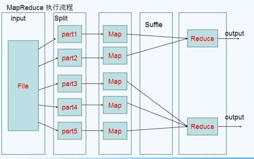
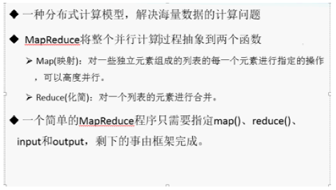
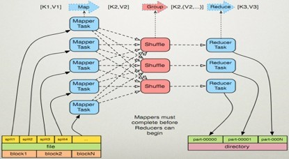
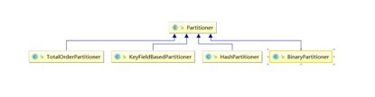
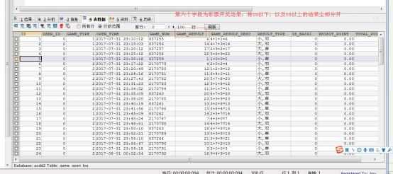
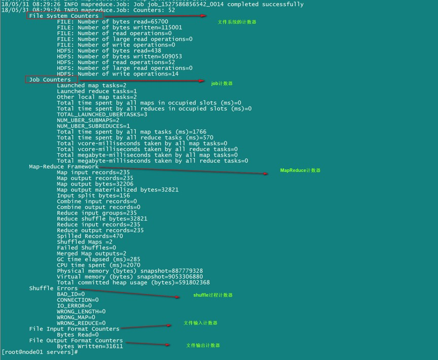

# Mapreduce

## 1. MapReduce 介绍

MapReduce思想在生活中处处可见。或多或少都曾接触过这种思想。MapReduce的思想核心是“分而治之”，适用于大量复杂的任务处理场景（大规模数据处理场景）。

* Map负责“分”，即把复杂的任务分解为若干个“简单的任务”来并行处理。可以进行拆分的前提是这些小任务可以并行计算，彼此间几乎没有依赖关系。
* Reduce负责“合”，即对map阶段的结果进行全局汇总。
* MapReduce运行在yarn集群
  1. ResourceManager
  2. NodeManager

这两个阶段合起来正是MapReduce思想的体现。



还有一个比较形象的语言解释MapReduce:

我们要数图书馆中的所有书。你数1号书架，我数2号书架。这就是“Map”。我们人越多，数书就更快。

现在我们到一起，把所有人的统计数加在一起。这就是“Reduce”。


#### 1.1 MapReduce 设计构思

MapReduce是一个分布式运算程序的编程框架，核心功能是将用户编写的业务逻辑代码和自带默认组件整合成一个完整的分布式运算程序，并发运行在Hadoop集群上。

MapReduce设计并提供了统一的计算框架，为程序员隐藏了绝大多数系统层面的处理细节。为程序员提供一个抽象和高层的编程接口和框架。程序员仅需要关心其应用层的具体计算问题，仅需编写少量的处理应用本身计算问题的程序代码。如何具体完成这个并行计算任务所相关的诸多系统层细节被隐藏起来,交给计算框架去处理：

Map和Reduce为程序员提供了一个清晰的操作接口抽象描述。MapReduce中定义了如下的Map和Reduce两个抽象的编程接口，由用户去编程实现 Map和Reduce, MapReduce处理的数据类型是<key,value>键值对。

* Map: `(k1; v1) → [(k2; v2)]`

* Reduce: `(k2; <v2>) → [(k3; v3)]`

  

一个完整的mapreduce程序在分布式运行时有三类实例进程：
1. `MRAppMaster` 负责整个程序的过程调度及状态协调
2. `MapTask` 负责map阶段的整个数据处理流程
3. `ReduceTask` 负责reduce阶段的整个数据处理流程







## 2. MapReduce 编程规范
> MapReduce 的开发一共有八个步骤, 其中 Map 阶段分为 2 个步骤，Shuffle 阶段 4 个步骤，Reduce 阶段分为 2 个步骤

#####  Map 阶段 2 个步骤

1. 设置 InputFormat 类, 将数据切分为 Key-Value**(K1和V1)** 对, 输入到第二步
2. 自定义 Map 逻辑, 将第一步的结果转换成另外的 Key-Value（**K2和V2**） 对, 输出结果

##### Shuffle 阶段 4 个步骤

3. 对输出的 Key-Value 对进行**分区**
4. 对不同分区的数据按照相同的 Key **排序**
5. (可选) 对分组过的数据初步**规约**, 降低数据的网络拷贝
6. 对数据进行**分组**, 相同 Key 的 Value 放入一个集合中

##### Reduce 阶段 2 个步骤

7. 对多个 Map 任务的结果进行排序以及合并, 编写 Reduce 函数实现自己的逻辑, 对输入的 Key-Value 进行处理, 转为新的 Key-Value（**K3和V3**）输出
8. 设置 OutputFormat 处理并保存 Reduce 输出的 Key-Value 数据

## 3. WordCount

> 需求: 在一堆给定的文本文件中统计输出每一个单词出现的总次数

##### Step 1. 数据格式准备

1. 创建一个新的文件
  ```shell
  cd /export/servers
  vim wordcount.txt
  ```
2. 向其中放入以下内容并保存
  ```text
  hello,world,hadoop
  hive,sqoop,flume,hello
  kitty,tom,jerry,world
  hadoop
  ```
3. 上传到 HDFS
  ```shell
  hdfs dfs -mkdir /wordcount/
  hdfs dfs -put wordcount.txt /wordcount/
  ```

##### Step 2. Mapper

```java
public class WordCountMapper extends Mapper<LongWritable,Text,Text,LongWritable> {
    @Override
    public void map(LongWritable key, Text value, Context context) throws IOException, InterruptedException {
        Text text = new Text();
        LongWritable longwritable = new LongWritable();
        //将第一行的文本数据进行拆分
        String line = value.toString();
        String[] split = line.split(",");
        //遍历数组，组装 K2 和 V2
        for (String word : split) {
            context.write(text, longwritable);
        }

    }
}
```

##### Step 3. Reducer

```java
public class WordCountReducer extends Reducer<Text,LongWritable,Text,LongWritable> {
    /**
     * 自定义我们的reduce逻辑	作用：将新的K2和V2转为K3和V3，将K3和V3写入上下文中
     * 所有的key都是我们的单词，所有的values都是我们单词出现的次数
     * @param key
     * @param values
     * @param context
     * @throws IOException
     * @throws InterruptedException
     */
    @Override
    protected void reduce(Text key, Iterable<LongWritable> values, Context context) throws IOException, InterruptedException {
        long count = 0;
        //遍历集合，将集合中的数字相加，得到V3
        for (LongWritable value : values) {
            count += value.get();
        }
        //将K3和V3写入上下文中
        context.write(key,new LongWritable(count));
    }
}
```

##### Step 4. 定义主类, 描述 Job 并提交 Job

```java
public class JobMain extends Configured implements Tool {
    @Override
    public int run(String[] args) throws Exception {
        Job job = Job.getInstance(super.getConf(), JobMain.class.getSimpleName());
        //打包到集群上面运行时候，必须要添加以下配置，指定程序的main函数
        job.setJarByClass(JobMain.class);
        //第一步：读取输入文件解析成key，value对
        job.setInputFormatClass(TextInputFormat.class);		//读取方式
        TextInputFormat.addInputPath(job,new Path("hdfs://192.168.174.100:8020/wordcount"));			//读取路径

        //第二步：设置我们的mapper类
        job.setMapperClass(WordCountMapper.class);
        //设置我们map阶段完成之后的输出类型
        job.setMapOutputKeyClass(Text.class);		//K2
        job.setMapOutputValueClass(LongWritable.class);		//V2
        //第三步，第四步，第五步，第六步，省略
        //第七步：设置我们的reduce类
        job.setReducerClass(WordCountReducer.class);
        //设置我们reduce阶段完成之后的输出类型
        job.setOutputKeyClass(Text.class);			//K3
        job.setOutputValueClass(LongWritable.class);		//V3
        //第八步：设置输出类以及输出路径
        job.setOutputFormatClass(TextOutputFormat.class);		
        TextOutputFormat.setOutputPath(job,new Path("hdfs://192.168.174.100:8020/wordcount_out"));		//该目录需要不存在
        //等待任务结束
        boolean b = job.waitForCompletion(true);
        return b?0:1;
    }

    /**
     * 程序main函数的入口类
     * @param args
     * @throws Exception
     */
    public static void main(String[] args) throws Exception {
        Configuration configuration = new Configuration();
        Tool tool  =  new JobMain();
        int run = ToolRunner.run(configuration, tool, args);
        System.exit(run);
    }
}
```

##### 常见错误

如果遇到如下错误

```text
Caused by: org.apache.hadoop.ipc.RemoteException(org.apache.hadoop.security.AccessControlException): Permission denied: user=admin, access=WRITE, inode="/":root:supergroup:drwxr-xr-x
```

直接将hdfs-site.xml当中的权限关闭即可

```xml
<property>
  <name>dfs.permissions</name>
  <value>false</value>
</property>
```

最后重启一下 HDFS 集群

##### 小细节

本地运行完成之后，就可以打成jar包放到服务器上面去运行了，实际工作当中，都是将代码打成jar包，开发main方法作为程序的入口，然后放到集群上面去运行

## 4. MapReduce 运行模式

##### 本地运行模式

4. MapReduce 程序是在本地以单进程的形式运行
2. 处理的数据及输出结果在本地文件系统

```java
TextInputFormat.addInputPath(job,new Path("file:///F:\\wordcount\\input"));
TextOutputFormat.setOutputPath(job,new Path("file:///F:\\wordcount\\output"));
```

##### 集群运行模式

1. 将 MapReduce 程序提交给 Yarn 集群, 分发到很多的节点上并发执行
2. 处理的数据和输出结果应该位于 HDFS 文件系统
3. 提交集群的实现步骤: 将程序打成JAR包并上传，然后在集群的任意一个节点上用hadoop命令启动

```shell
hadoop jar hadoop_hdfs_operate-1.0-SNAPSHOT.jar cn.itcast.hdfs.demo1.JobMain
```

## 5. MapReduce 分区

在 MapReduce 中, 通过我们指定分区, 会将同一个分区的数据发送到同一个 Reduce 当中进行处理

例如: 为了数据的统计, 可以把一批类似的数据发送到同一个 Reduce 当中, 在同一个 Reduce 当中统计相同类型的数据, 就可以实现类似的数据分区和统计等

其实就是相同类型的数据, 有共性的数据, 送到一起去处理

Reduce 当中默认的分区只有一个



需求：将以下数据进行分开处理

详细数据参见partition.csv  这个文本文件，其中第五个字段表示开奖结果数值，现在需求将15以上的结果以及15以下的结果进行分开成两个文件进行保存



##### Step 1. 定义 Mapper

这个 Mapper 程序不做任何逻辑, 也不对 Key-Value 做任何改变, 只是接收数据, 然后往下发送

```java
public class MyMapper extends Mapper<LongWritable,Text,Text,NullWritable>{
    @Override
    protected void map(LongWritable key, Text value, Context context) throws IOException, InterruptedException {
        context.write(value,NullWritable.get());
    }
}
```

##### Step 2. 定义 Reducer 逻辑

这个 Reducer 也不做任何处理, 将数据原封不动的输出即可

```java
public class MyReducer extends Reducer<Text,NullWritable,Text,NullWritable> {
    @Override
    protected void reduce(Text key, Iterable<NullWritable> values, Context context) throws IOException, InterruptedException {
        context.write(key,NullWritable.get());
    }
}
```

##### Step 3. 自定义 Partitioner

主要的逻辑就在这里, 这也是这个案例的意义, 通过 Partitioner 将数据分发给不同的 Reducer

```java
public class PartitonerOwn extends Partitioner<Text,LongWritable> {
    @Override
    public int getPartition(Text text, LongWritable longWritable, int i) {
        //拆分行文本数据（K2），获取中奖字段
        String[] split = text.toString().split("\t");
        String numStr = split[5];
        //判断中奖字段的值和15的关系，返回对应分区编号
        if (Integer.parseInt(numStr) > 15){    
            return  1;
        }else{
            return 0;
        }
    }
}
```

##### Step 4. Main 入口

```java
public class PartitionMain  extends Configured implements Tool {
    public static void main(String[] args) throws  Exception{
       Configuration configuration = new Configuration();
        int run = ToolRunner.run(configuration, new JobMain(), args);
        System.exit(run);
    }
    @Override
    public int run(String[] args) throws Exception {
        Job job = Job.getInstance(super.getConf(), "partition_mapreduce");
        job.setJarByClass(PartitionMain.class);
        //设置输入类和输入的路径
        job.setInputFormatClass(TextInputFormat.class);
        TextInputFormat.addInputPath(job,new Path("hdfs://192.168.174.100:8020/partitioner"));    
		//设置Mapper类和数据类型
        job.setMapperClass(MyMapper.class);
        job.setMapOutputKeyClass(Text.class);
        job.setMapOutputValueClass(NullWritable.class);
        //指定分区类
        job.setPartitionerClass(PartitonerOwn.class);        
 		//指定Reducer的类和数据类型
        job.setReducerClass(MyReducer.class);
        job.setOutputKeyClass(Text.class);
        job.setOutputValueClass(NullWritable.class);
        //设置ReduceTask的个数
        job.setNumReduceTasks(2);
        //指定输出类和路径
        job.setOutputFormatClass(TextOutputFormat.class);
        TextOutputFormat.setOutputPath(job,new Path("hdfs://192.168.174.100:8020/outpartition"));
        
        boolean b = job.waitForCompletion(true);
        return b?0:1;       
    }
}
```


## 6. MapReduce 中的计数器

计数器是收集作业统计信息的有效手段之一，用于质量控制或应用级统计。计数器还可辅助诊断系统故障。如果需要将日志信息传输到 map 或 reduce 任务， 更好的方法通常是看能否用一个计数器值来记录某一特定事件的发生。对于大型分布式作业而言，使用计数器更为方便。除了因为获取计数器值比输出日志更方便，还有根据计数器值统计特定事件的发生次数要比分析一堆日志文件容易得多。

hadoop内置计数器列表

| **MapReduce任务计数器** | **org.apache.hadoop.mapreduce.TaskCounter**                  |
| ----------------------- | ------------------------------------------------------------ |
| 文件系统计数器          | org.apache.hadoop.mapreduce.FileSystemCounter                |
| FileInputFormat计数器   | org.apache.hadoop.mapreduce.lib.input.FileInputFormatCounter |
| FileOutputFormat计数器  | org.apache.hadoop.mapreduce.lib.output.FileOutputFormatCounter |
| 作业计数器              | org.apache.hadoop.mapreduce.JobCounter                       |

**每次mapreduce执行完成之后，我们都会看到一些日志记录出来，其中最重要的一些日志记录如下截图**



**所有的这些都是MapReduce的计数器的功能，既然MapReduce当中有计数器的功能，我们如何实现自己的计数器？？？**

**需求：以以上分区代码为案例，统计map接收到的数据记录条数**

##### 第一种方式

**第一种方式定义计数器，通过context上下文对象可以获取我们的计数器，进行记录**
**通过context上下文对象，在map端使用计数器进行统计**

```java
public class PartitionMapper  extends Mapper<LongWritable,Text,Text,NullWritable>{
    //map方法将K1和V1转为K2和V2
    @Override
    protected void map(LongWritable key, Text value, Context context) throws Exception{
        //定义计数器
        Counter counter = context.getCounter("MR_COUNT", "MyRecordCounter");
        //每次执行，计数器变量加1
        counter.increment(1L);
        context.write(value,NullWritable.get());
    }
}
```

**运行程序之后就可以看到我们自定义的计数器在map阶段读取了七条数据**


##### **第二种方式**

**通过enum枚举类型来定义计数器**
统计reduce端数据的输入的key有多少个

```java
public class PartitionerReducer extends Reducer<Text,NullWritable,Text,NullWritable> {
   public static enum Counter{
       MY_REDUCE_INPUT_RECORDS,MY_REDUCE_INPUT_BYTES
   }
    @Override
    protected void reduce(Text key, Iterable<NullWritable> values, Context context) throws IOException, InterruptedException {
       //使用枚举定义计数器
       context.getCounter(Counter.MY_REDUCE_INPUT_RECORDS).increment(1L);
       context.write(key, NullWritable.get());
    }
}
```


